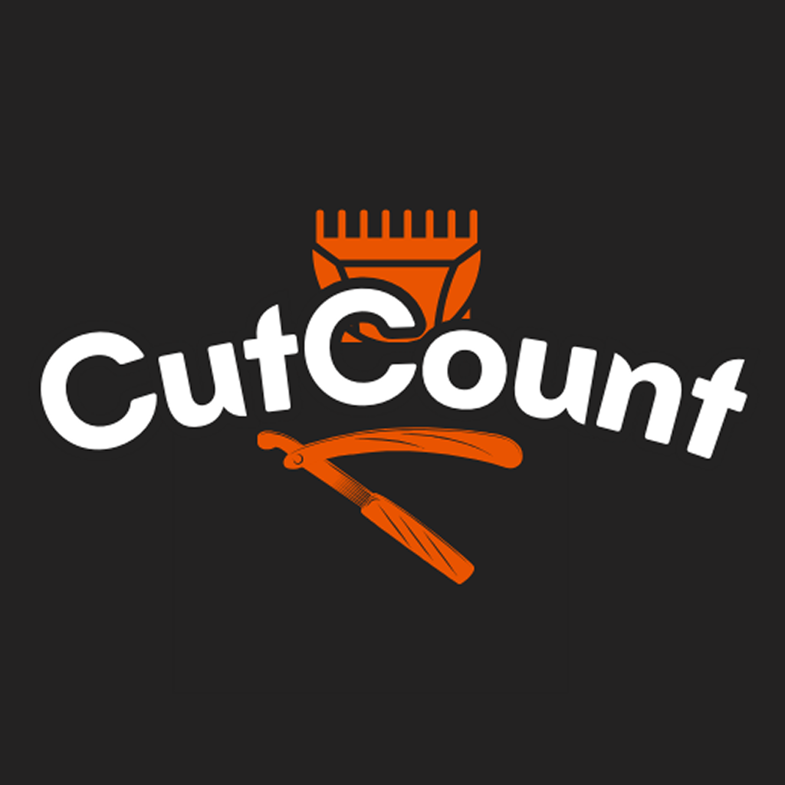

# Cut Count



Cut Count is a barber-only shop management app built to help barbers record daily cuts, track total amount, view monthly performance, manage services, inspect history, and keep the shop workflow simple.

## Why We Created This App

Most barber shops still track earnings and cuts in notebooks, memory, or scattered phone notes. That causes a few common problems:

- daily cuts are forgotten
- amounts are not counted correctly
- monthly progress is hard to review
- service prices become inconsistent
- history is difficult to search later

Cut Count solves that by putting everything in one clean app focused on barber shop operations.

## What Problem It Solves

This app is designed to answer the questions barbers ask every day:

- How many cuts did I do today?
- How much money did I make today?
- Which services are popular?
- How did this month perform?
- What happened on a specific day?

Instead of using separate notes or a calculator, the barber can open one app and see the full shop picture.

## Core Purpose

- manage daily cuts and daily amount
- view monthly cuts and monthly amount with graphs
- add and maintain service prices
- check today history and monthly history
- review profile-level shop performance

## How The App Works

1. The app opens with onboarding for new users.
2. The barber enters the app and lands on the dashboard.
3. The dashboard shows today summary, services, and recent cuts.
4. The barber can add services from the Services screen.
5. The History screen shows today history and monthly history.
6. Monthly history opens a month detail page for day-by-day review.
7. The Profile screen shows all-time performance graphs and quick actions.
8. Settings lets the barber control theme, currency, biometric access, and notifications.

## Step-by-Step User Flow

### 1. First Launch

- The onboarding screen explains what the app does.
- The app remembers if onboarding was already seen.
- Returning users skip onboarding automatically.

### 2. Dashboard

- The barber sees today summary cards.
- The barber can review active services in a horizontal scroll list.
- The barber can inspect recent cuts and amounts.

### 3. Services

- Tap the floating `+` button to add a service.
- Enter service name, price, note, and choose an icon.
- Saved services appear in the list immediately.

### 4. History

- Toggle between Today and Monthly.
- Today shows the current day list.
- Monthly shows month cards.
- Tapping a month opens detailed day-by-day history for that month.

### 5. Profile

- See the barber name and avatar.
- Review all-time cuts and all-time amount.
- Read charts that show performance over time.
- Use quick action tiles for future user actions.

### 6. Settings

- Change theme.
- Change currency.
- Enable biometric login.
- Manage notifications.
- Review future features and how to use the app.

## Screens

### Dashboard

Shows:

- today cuts
- today amount
- monthly cuts
- monthly amount
- services list
- recent cuts

### Services

Used to manage shop services such as:

- fade cut
- shave
- hair wash
- styling
- beard trim

### History

Used to view:

- today history
- monthly history
- month detail history

### Profile

Used to show:

- barber profile info
- all-time cuts
- all-time amount
- graph-based performance summary
- quick action items

### Settings

Used to manage:

- theme
- currency
- biometric access
- notifications
- future feature list
- how-to-use help section

## Future Features

The app is structured to grow into more advanced shop management tools. Planned ideas include:

- biometric unlock
- cloud backup
- receipt printer support
- advanced analytics
- staff management
- multi-language support
- export history to file
- better shop profile sharing
- voice command support

## Voice Command Idea

One future feature is voice command support so the barber can say something like:

- "Add cut"
- "Show today amount"
- "Open monthly history"
- "Know service details"

This would help when the barber is busy and wants faster input without typing.

## Help Materials

If you are new to the app, start here:

### Quick Help

- Use Dashboard for quick daily overview.
- Use Services to maintain prices.
- Use History to review past work.
- Use Profile to see overall shop progress.
- Use Settings if you want to change how the app looks or behaves.

### Best Practices

- Add services first so prices stay organized.
- Check daily history before closing the shop.
- Review monthly graphs at the end of the week.
- Keep theme and currency settings consistent for your shop.

### Suggested Daily Routine

1. Open Dashboard in the morning.
2. Add services or check the current list.
3. Use History during the day to review entries.
4. End the day by checking today amount and total cuts.
5. Review monthly progress from the Profile screen.

## Project Structure

```text
lib/
  core/
    constants/        shared padding and spacing values
    layout/           phone and tablet breakpoint helpers
    theme/            light and dark theme configuration
    widgets/          reusable UI widgets used across features
  features/
    onboard/          onboarding state, model, widgets, and screen
    dashboard/        dashboard summary cards and overview layout
    services/         services state and service management UI
    history/          today/month history providers and screens
    profile/          all-time graphs and profile actions
    settings/         app preferences and future feature list
  routes/             named routes and GoRouter setup
```

## Reusable Components

This app uses shared widgets so the UI stays consistent:

- `ReusableAutoSizeText`
- `ReusableButton`
- `ReusableTextField`
- `CustomListTile`
- `ReusableAppbar`
- `AppUi`

## Fonts

Typography is intentionally split for better hierarchy:

- `Unbounded` for app bar and large title text
- `Poppins` for medium and small headings
- `Inter` for body text and general UI text

[//]: # (## Assets)

[//]: # ()
[//]: # (- `assets/images/logo.png`)

[//]: # (- `assets/images/splash.png`)

[//]: # (- `assets/images/HairCutting.jpeg`)

[//]: # (- `assets/images/BeardCutting.jpeg`)

[//]: # (- `assets/images/Shaving.jpeg`)

[//]: # (- `assets/images/Shower.jpeg`)

[//]: # (- `assets/images/pic.png`)

## How To Run

1. Install Flutter SDK.
2. Open the project folder.
3. Run:

```bash
flutter pub get
flutter run
```

## Notes

- The app currently uses local state and `SharedPreferences` for persistence.
- Some planned features are listed in Settings but not fully implemented yet.
- The UI is designed for barber shop management first, not for general business use.

